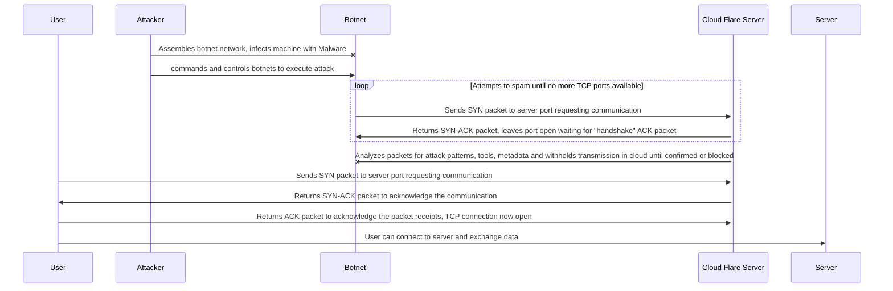

    
In this scenerio, a business using cloud flare is being attacked by a SYN DDoS method

First the attacker infects external computer with malware for botnet

Then Attacker connects and executes command to carry out attack

The botnet Sends SYN packet to cloud server to request communications
Cloudflare will analyze packets, trying to detect attack patterns, concerning meta data, unconfirmed handshakes.
If cloudflare detects numerous SYN packets from specified IP's Cloudflare can limit the rate on specific IP adresses
Cloudlflare witholds packets from being sent to server until handshakes are confirmed and data is filtered.

If connection request is valid, its passed to server.